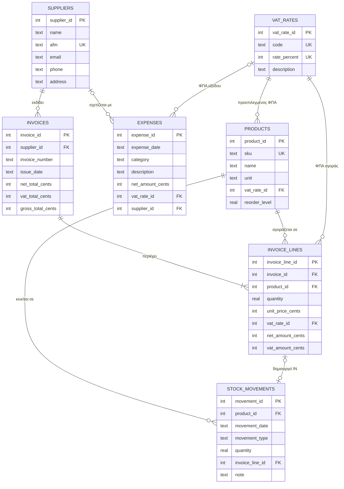

# ER διάγραμμα

Το διάγραμμα αποδίδεται αυτόματα στο GitHub (Mermaid).

```mermaid
erDiagram
    SUPPLIERS ||--o{ INVOICES : "εκδίδει"
    SUPPLIERS |o--o{ EXPENSES : "σχετίζεται με"
    INVOICES ||--|{ INVOICE_LINES : "περιέχει"
    PRODUCTS ||--o{ INVOICE_LINES : "αγοράζεται σε"
    PRODUCTS ||--o{ STOCK_MOVEMENTS : "κινείται σε"
    INVOICE_LINES |o--o| STOCK_MOVEMENTS : "δημιουργεί IN"
    VAT_RATES ||--o{ PRODUCTS : "προεπιλεγμένος ΦΠΑ"
    VAT_RATES ||--o{ INVOICE_LINES : "ΦΠΑ αγοράς"
    VAT_RATES |o--o{ EXPENSES : "ΦΠΑ εξόδου"

    VAT_RATES {
        int vat_rate_id PK
        text code UK
        int rate_percent UK
        text description
    }
    SUPPLIERS {
        int supplier_id PK
        text name
        text afm UK
        text email
        text phone
        text address
    }
    PRODUCTS {
        int product_id PK
        text sku UK
        text name
        text unit
        int vat_rate_id FK
        real reorder_level
    }
    INVOICES {
        int invoice_id PK
        int supplier_id FK
        text invoice_number
        text issue_date
        int net_total_cents
        int vat_total_cents
        int gross_total_cents
    }
    INVOICE_LINES {
        int invoice_line_id PK
        int invoice_id FK
        int product_id FK
        real quantity
        int unit_price_cents
        int vat_rate_id FK
        int net_amount_cents
        int vat_amount_cents
    }
    EXPENSES {
        int expense_id PK
        text expense_date
        text category
        text description
        int net_amount_cents
        int vat_rate_id FK
        int supplier_id FK
    }
    STOCK_MOVEMENTS {
        int movement_id PK
        int product_id FK
        text movement_date
        text movement_type
        real quantity
        int invoice_line_id FK
        text note
    }
```
